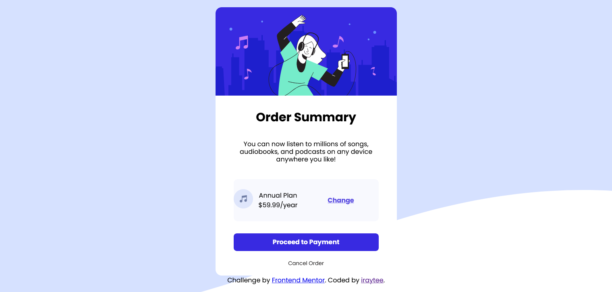

# Frontend Mentor - Order summary card solution

This is a solution to the [Order summary card challenge on Frontend Mentor](https://www.frontendmentor.io/challenges/order-summary-component-QlPmajDUj). Frontend Mentor challenges help you improve your coding skills by building realistic projects. 

## Table of contents

- [Overview](#overview)
  - [The challenge](#the-challenge)
  - [Screenshot](#screenshot)
  - [Links](#links)
- [My process](#my-process)
  - [Built with](#built-with)
  - [What I learned](#what-i-learned)
  - [Useful resources](#useful-resources)
- [Author](#author)

**Note: Delete this note and update the table of contents based on what sections you keep.**

## Overview

### The challenge

Users should be able to:

- See hover states for interactive elements

### Screenshot




### Links

- Solution URL: [Add solution URL here](https://your-solution-url.com)
- Live Site URL: [Add live site URL here](https://your-live-site-url.com)

## My process

### Built with

- Semantic HTML5 markup
- CSS custom properties
- Flexbox
- Mobile-first workflow
- [Styled Components](https://styled-components.com/) - For styles


### What I learned

```html
<div class="plan-info">
                  <div class="music-icon">
                      
                  </div>
                  <div class="sub-info">
                    <span>Annual Plan</span> <br>
                    <span>$59.99/year</span> <br>
                  </div>
                  <div class="sub-change">
                    <a href="/">Change</a> 
                  </div> 
              </div>
```
```css
*{
    box-sizing: border-box;
    font-family: 'Poppins', sans-serif;
    padding: 0;
    
}

body {
    display: flex;
    flex-direction: column;
    justify-content: center;
    align-items: center;
    min-height: 100vh;
    line-height: 1.5;
    background: no-repeat url(../images/pattern-background-mobile.svg);
    background-size: cover;
}
```


### Useful resources

- [Example resource 1](https://www.w3schools.com) - This helped me for html semantic markup. I really liked this pattern and will use it going forward.
- [Example resource 2](https://www.csstricks.com) - This is an amazing article which helped me finally understand more on css. I'd recommend it to anyone still learning css flexbox concept.

## Author

- Frontend Mentor - [@iraytee-code](https://www.frontendmentor.io/profile/iraytee-code)
- Twitter - [@EA_techofficial](https://www.twitter.com/EA_techofficial)
